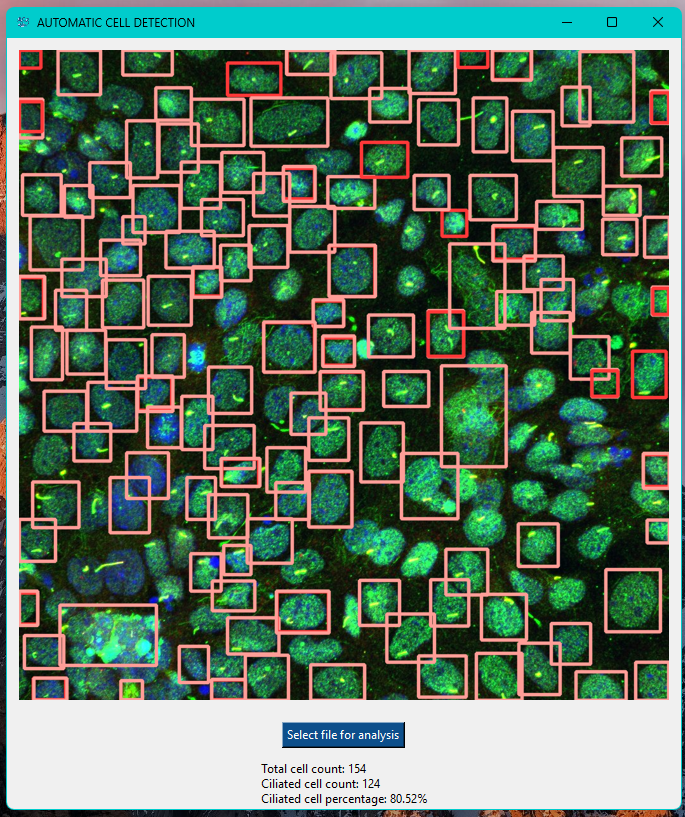

# YOLOv8-Cell-Counting

## Description ##

This repository contains the code to train a custom YOLOv8 object detection model to identify and count the proportion of cells in a microscopy image that are occupied by ciliated cells.

### Pip dependencies ###
- ultralytics
- seaborn
- tkinter
- Pillow
- numpy
- pandas

### Getting started ###
- model_train.py contains example code used to train YOLOv8n model on a custom image dataset (NOT INCLUDED IN REPOSITORY), using the configuration settings specified in config.yaml
- 'best.pt' model was chosen from the training weights and renamed as 'sample_cilia_counter_100.pt'
- gui_application.py contains example code used to take image input from open file dialogue, and run YOLOv8 object detection on the selected image. Bounding boxes and respective cell counts are then displayed on the application window (see example screenshot below).
- **N.B. Model training was only done on 10 images; training on a larger dataset will be required to yield more accurate results!**

## Example Screenshot ##

